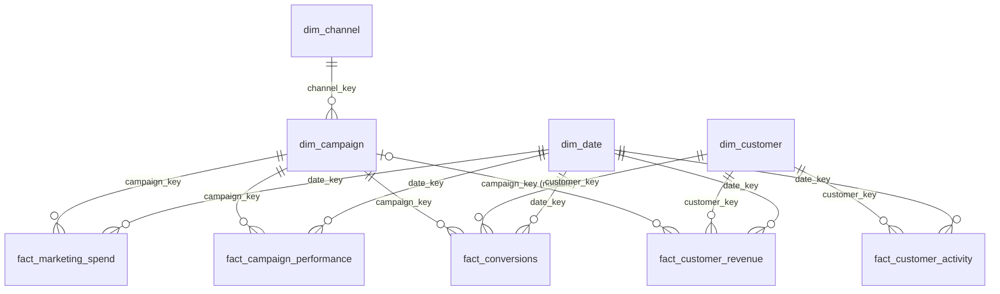

# Marketing Performance, Customer Acquisition & Lifetime Value Analytics

**Does marketing spend buy customers who are worth what they cost?** An end-to-end analysis of 7 channels, 220 campaigns and 185K records, from raw CSV extracts to a MySQL star schema and a four-page Power BI dashboard.


| Marketing spend | Attributed revenue | Blended ROAS | CAC | Revenue per customer (observed LTV) | LTV : CAC |
|---:|---:|---:|---:|---:|---:|
| ≈ ₹230M | ≈ ₹89M | 0.39 | ₹74.8K | ≈ ₹10K | 0.09 – 0.16 (every channel < 1) |

**Navigate:** [Business problem](#business-problem) · [Data quality](#data-quality-assessment) · [SQL analysis](#sql-analysis) · [KPIs](#kpi-framework) · [Data model](#data-model) · [Dashboard](#dashboard) · [Findings](#key-findings) · [Business impact](#business-impact) · [Recommendations](#business-recommendations) · [Next steps](#what-i-would-do-next) · [How to run](#how-to-run-this-project) · [Limitations](#limitations-and-validation)

---

> **Executive Takeaways**
>
> - 🔴 **ROAS 0.39** — every ₹1 spent returned ₹0.39 of attributed revenue (0.36–0.42 in every channel).
> - 🔴 **LTV:CAC below 1 in all seven channels** — customers have generated ≈ ₹10K of revenue against a ₹74.8K acquisition cost.
> - 🔴 **99.6% lead-to-customer gap** — the largest funnel loss is downstream of the click, and is uniform across channels.
> - 🟠 **Affiliate underperforms** — highest CAC, lowest LTV, and the only channel statistically separable from the best.
> - 🟢 **Measure first, then reallocate** — attribution and LTV definitions must be fixed before budget is moved.
>
> *Statistical validation prevented a misleading recommendation: Referral has the highest LTV:CAC, but ANOVA (p = 0.27) and bootstrap confidence intervals show most channel differences sit within sampling variation. Only Affiliate is clearly weaker.*

> **Terminology.** "LTV" in this project means **observed (revenue) LTV** — a customer's cumulative net revenue to date. It is not margin-based and not a forecast of future value (see [KPI Framework](#kpi-framework)).

---

## Executive Summary

**What was analysed.** Six source extracts — campaigns, daily campaign performance, customers, conversions, transactions and activity (185,219 rows, January 2023 – July 2026) — covering 7 acquisition channels, 220 campaigns and 9,985 customers.

**Why.** To test whether marketing investment produces efficient customer acquisition and customer value, and to locate where the funnel and the unit economics break down.

**How.** The data was profiled and cleaned in MySQL (four date formats, 22 channel-label variants, mixed ₹/$ symbols, duplicates, invalid spend and click values), modelled as a star schema, and analysed with SQL (CTEs, window functions, cohort logic, views, stored procedures). Results are presented in a four-page Power BI dashboard. A Python script independently recomputes the headline KPIs as a cross-check.

**What was found.** Recorded revenue was well below spend (blended ROAS 0.39; 0.36–0.42 in every channel). Customer acquisition cost (₹74.8K) is roughly seven to eight times the revenue each customer has generated to date (≈ ₹10K), so LTV:CAC is below 1 for all seven channels. About 99.6% of leads do not appear as customers. Differences between channels are small; only Affiliate (highest CAC, lowest LTV) stands out.

**Main implication.** On this data no channel recovers its acquisition cost, and channel rankings are too close to justify budget shifts on their own. The first priority is to fix measurement — one attribution definition, margin-based LTV, a time-windowed retention measure — before reallocating spend.

---

## Business Problem

Marketing teams need to see both **acquisition efficiency** and **customer economics**. This project is built around the questions the SQL scripts answer:

- Which channels and campaigns acquire the most customers, and at what cost (CAC)?
- Is customer lifetime value sufficient to justify acquisition cost (LTV:CAC)?
- Which channels and campaigns return more revenue per rupee spent (ROAS, ROI)?
- Where do prospects drop out of the funnel (impressions → clicks → leads → customers)?
- How well are customers retained, and do newer cohorts behave differently?
- Is spend concentrated in a few campaigns or spread thinly?

**Intended audience:** marketing and growth teams, campaign managers, business analysts and management.

## Objectives

1. Load, profile and validate six inconsistent source files.
2. Standardise dates, categories, currencies and keys; remove duplicates and invalid records.
3. Model the data as a star schema that supports spend, revenue, conversion and activity analysis without double counting.
4. Define and calculate CAC, LTV, LTV:CAC, ROAS, ROI, funnel conversion, retention and cohort KPIs.
5. Compare channels and campaigns and identify performance gaps.
6. Present the results in a Power BI dashboard and translate them into recommendations.

---

## Dataset Overview

| Dataset / table | Raw rows | Cleaned rows | Purpose |
|---|---:|---:|---|
| `customers.csv` | 10,500 | 9,985 | Customer profile, signup date, CRM acquisition channel |
| `campaigns.csv` | 225 | 220 | Campaign name, channel, type, start/end dates |
| `campaign_performance.csv` | 25,184 | 25,164 | Daily impressions, clicks, leads and spend per campaign |
| `conversions.csv` | 19,000 | 18,940 | Funnel-stage events (Lead, MQL, SQL, Opportunity, Customer) |
| `transactions.csv` | 58,310 | 58,000 | Customer purchases and refunds with optional campaign ID |
| `activity.csv` | 72,000 | 72,000 | Customer engagement events (8 activity types) |
| **Total** | **185,219** | **184,309** | |

- **Period:** 2023-01-04 to 2026-07-15 for spend and performance (43 calendar months); transactions run to August 2026.
- **Dimensions:** channel (7), campaign (220), campaign type (4), customer, date, industry, country.
- **Measures:** spend, impressions, clicks, leads, revenue, conversion stage, activity events.
- **Source:** the files in `data_raw/`; the original source system is not documented in the repository (see [Data Privacy](#data-privacy)).
- Full column-level detail: [docs/data_dictionary.md](docs/data_dictionary.md).

---

## Data Quality Assessment

Profiling queries (`sql/01b_raw_data_validation.sql`) quantified each defect before any cleaning. Every row below was confirmed by re-running the scripts; the complete log with counts is in [docs/data_quality_log.md](docs/data_quality_log.md).

| Problem | Detection | Cleaning approach | Final result |
|---|---|---|---|
| Four date formats in every date column; 435 customer signup dates blank | Regex format census | `CASE` + `REGEXP` → `STR_TO_DATE`; missing dates mapped to an `19000101` unknown member | All dates typed; 4.0% of spend (₹9.2M) and 2,397 transactions are undated |
| 22 channel-name variants (53–72 raw spellings: "Paid-Search", "PPC", "Google Ads", "Affliate", …) | Distinct-value listing | `CASE` on `LOWER(TRIM())` | 7 canonical channels |
| ₹ and $ symbols and thousands separators inside spend (3,116 rows) and revenue (3,665 rows) | Regex `[^0-9.-]` | `REGEXP_REPLACE` → `DECIMAL`; **no FX conversion** | Numeric fields |
| Duplicate customers (500 surplus rows + 15 blank ids), 5 duplicate campaigns, 300 duplicate transactions, 10 blank transaction rows | Key-duplicate counts | `ROW_NUMBER()` de-duplication | 10,500 → 9,985 customers; 58,310 → 58,000 transactions |
| Negative spend (140 rows) and negative revenue (236 rows) | Sign check | Spend → NULL; revenue kept and flagged `is_refund` | Spend excludes ₹1.09M of negatives; revenue is net of ₹0.39M refunds |
| Clicks greater than impressions (259 rows) | Row comparison | Clicks set to NULL | Funnel logic holds (0 violations after cleaning) |
| Orphan keys (20 performance rows, 60 conversions) | Anti-join | Removed by `INNER JOIN` to staged dimensions | Referential integrity: 0 orphans in every fact |
| 9.9% of transactions (₹10.2M) have no campaign | Null-attribution check | Kept with NULL `campaign_key` | Excluded from ROAS; reported separately |
| About half of dated events fall before the recorded signup date | Caveat query in `11_retention_analysis.sql` | Retention logic counts only post-signup events | `signup_date` treated with caution |

Net effect: 910 of 185,219 rows (0.5%) removed; other defects were nulled or flagged rather than deleted.

---

## Data Cleaning & Preparation

### SQL cleaning (primary method)
`sql/01` loads everything as text so no load can fail; `01b` profiles it; `02` writes typed `stg_*` tables:

- **Validation:** counts of blanks, duplicates, variants, formats and orphans before changing anything, so each rule can be justified and its impact measured.
- **Standardisation:** `TRIM`/`NULLIF`, `CASE` mappings for channel and country, a four-pattern date parser, `REGEXP_REPLACE` for currency symbols.
- **De-duplication:** `ROW_NUMBER() OVER (PARTITION BY id …)` in a CTE; for customers the row with an email is preferred (the duplicate copies differ only in blank vs. populated email).
- **Integrity:** `INNER JOIN` to staged dimensions removes orphan records; transactions keep a `LEFT JOIN` to campaigns so unattributed sales are retained.
- **Reporting layer:** three materialised tables (first-touch attribution, customer LTV, customer retention) and ten views, refreshed by `sp_refresh_materialized_tables`, so every report shares one definition of each metric.

### Python
Python was not part of the original cleaning workflow. [`validation/verify_kpis.py`](validation/verify_kpis.py) re-implements the cleaning rules and KPI logic with pandas as an independent check (see [Python Analysis](#python-analysis)).

### BI preparation
Power BI imports the reporting views from `sql/14_create_views.sql` (`powerbi/marketing_analytics.pbix`). The model has 12 tables, 10 relationships, 15 DAX measures (blended ROAS, overall ROI, CAC, average LTV, LTV:CAC, retention rate, monthly spend/revenue) and one calculated column (`Is Top 5 Campaign`); all are documented in [docs/powerbi_model.md](docs/powerbi_model.md). The model is a hub of channel-level tables rather than a star over the SQL facts, so ratios cannot be recomputed from facts inside Power BI.

---

## Analytical Approach

```
Raw CSVs ──► Load as text ──► Profile ──► Clean & type ──► Star schema ──► Validate
 (6 files)    (01)            (01b)       (02)             (03, 04)        (05)
                                                                              │
Recommendations ◄── Findings ◄── Dashboard ◄── Views / procs ◄── KPIs & analysis (06–13)
                                  (Power BI)      (14, 15)        funnel · CAC · ROAS · LTV
                                                                  retention · cohorts
```

1. **Ingestion & validation** — raw layer plus profiling queries.
2. **Cleaning & transformation** — typed staging tables, then dimensions and facts with an unknown-date member.
3. **KPI calculation** — each fact table is aggregated in its own CTE and joined on conformed keys, which prevents the row multiplication that would double-count spend or revenue.
4. **Segmentation / cohort analysis** — channel, campaign and signup-month cohort views (M0–M4).
5. **Visualisation** — four Power BI pages from the reporting views.
6. **Insight & recommendation** — findings are stated at the strength the data supports; see [limitations](#limitations-and-validation).

---

## SQL Analysis

Scripts `06`–`13` contain roughly 70 analytical queries; see [sql/README.md](sql/README.md) for the full index. Techniques and the business reason for each:

| Technique | Where | Why it was needed |
|---|---|---|
| CTEs that aggregate each fact separately | all KPI scripts | Joining spend, conversions and revenue directly would multiply rows and overstate totals |
| `ROW_NUMBER() OVER (PARTITION BY customer ORDER BY date)` | first-touch attribution, de-duplication | Count each customer once and assign them to the campaign that converted them first |
| `RANK` / `DENSE_RANK` / `NTILE` / `PERCENT_RANK` | `07`, `09`, `10`, `13` | Rank channels and campaigns and flag top/bottom quartiles that totals alone hide |
| `LAG` and moving-average frames | `06`, `08`, `09` | Month-over-month growth and 3-month smoothing of CAC and ROAS |
| `AVG(x) OVER ()` quadrant flags | `07`, `09`, `13` | Compare each campaign with the portfolio average without a self-join |
| Recursive CTE calendar | `04` | Build a date dimension without an external table |
| `TIMESTAMPDIFF(MONTH, …)` cohort offsets | `12` | Align customers by months since signup |
| Views, materialised tables, stored procedures | `14`, `15` | Reusable, consistent KPI definitions for Power BI |

### 1. Customer acquisition cost by channel

**Business question** — What does it cost to acquire a customer in each channel?

```sql
-- sql/08_cac_analysis.sql (Q2), abridged
WITH first_customer_conversion AS (
    SELECT fc.customer_key, fc.campaign_key,
           ROW_NUMBER() OVER (PARTITION BY fc.customer_key ORDER BY dd.full_date) AS rn
    FROM fact_conversions fc JOIN dim_date dd ON fc.date_key = dd.date_key
    WHERE fc.conversion_stage = 'Customer' AND dd.date_key <> 19000101
),
channel_customers AS (  -- customers per channel, each counted once
    SELECT dch.channel_name, COUNT(*) AS customers_acquired
    FROM first_customer_conversion fcc
    JOIN dim_campaign dcamp ON fcc.campaign_key = dcamp.campaign_key
    JOIN dim_channel  dch   ON dcamp.channel_key = dch.channel_key
    WHERE fcc.rn = 1 GROUP BY dch.channel_name
),
channel_spend AS (
    SELECT dch.channel_name, SUM(fms.spend) AS total_spend
    FROM fact_marketing_spend fms JOIN dim_channel dch ON fms.channel_key = dch.channel_key
    GROUP BY dch.channel_name
)
SELECT cs.channel_name, cs.total_spend, cc.customers_acquired,
       ROUND(cs.total_spend / NULLIF(cc.customers_acquired, 0), 2) AS cac
FROM channel_spend cs LEFT JOIN channel_customers cc USING (channel_name);
```

**What it shows** — CAC ranges from ₹67.8K (Display) to ₹86.7K (Affiliate). Affiliate spends ₹28.9M for 333 customers, the fewest of any channel.

### 2. Return on ad spend by channel

**Business question** — How much revenue does each ₹1 of spend return, and is any channel profitable on a revenue basis?

```sql
-- sql/09_campaign_analysis.sql (Q5/Q9), abridged
SELECT cs.channel_name,
       ROUND(cr.total_revenue / NULLIF(cs.total_spend, 0), 3)                       AS roas,
       ROUND((cr.total_revenue - cs.total_spend) / NULLIF(cs.total_spend, 0), 3)   AS roi
FROM channel_spend cs JOIN channel_revenue cr ON cs.channel_name = cr.channel_name;
```

**What it shows** — ROAS is 0.36 (Affiliate) to 0.42 (Referral); ROI is −0.58 to −0.64 by channel and **−0.61 for the portfolio** (`vw_kpi_summary`). Revenue and spend are aggregated in separate CTEs before joining, and portfolio ROI is a ratio of sums: adding the 220 campaign ROIs would give a meaningless −121.86.

### 3. Observed LTV versus CAC

**Business question** — Have customers generated enough revenue so far to cover what it cost to acquire them?

```sql
-- sql/10_ltv_analysis.sql (Q5), abridged
SELECT channel_name, ROUND(cac, 2) AS cac, ROUND(avg_ltv, 2) AS avg_ltv,
       ROUND(avg_ltv / NULLIF(cac, 0), 3) AS ltv_to_cac_ratio,
       CASE WHEN avg_ltv / NULLIF(cac, 0) >= 3 THEN 'STRONG'
            WHEN avg_ltv / NULLIF(cac, 0) >= 1 THEN 'MARGINAL'
            ELSE 'POOR' END AS unit_economics_verdict
FROM channel_metrics;
```

**What it shows** — All seven channels score "POOR" (0.094–0.157). Even the best channel recovers about 16 paise of acquisition cost per rupee.

### 4. Retention flag and cohort matrix

**Business question** — Do customers stay active after the first month, and how does activity evolve by signup cohort?

```sql
-- sql/11_retention_analysis.sql, abridged: 1 if any activity/purchase occurs > 30 days after signup
MAX(CASE WHEN pse.event_date > dc.signup_date + INTERVAL 30 DAY THEN 1 ELSE 0 END) AS is_retained

-- sql/12_cohort_analysis.sql, abridged: active customers per month offset
COUNT(DISTINCT CASE WHEN TIMESTAMPDIFF(MONTH, cc.signup_date, ee.event_date) = 1
                    THEN cc.customer_key END) / COUNT(DISTINCT cc.customer_key) AS m1_retention
```

**What it shows** — 86.4% of customers have at least one later event after day 30, whereas in any given month after signup only about a quarter of a cohort is active (average 23.9–25.2% for M1–M4). The two figures measure different things (see [KPI notes](docs/kpi_definitions.md)).

---

## Python Analysis

The analysis itself was performed in SQL. Python is used for **independent validation**: `validation/verify_kpis.py` (pandas, NumPy, SciPy) recomputes the cleaning and KPIs straight from `data_raw/`; its output is saved in [`validation/validation_output.txt`](validation/validation_output.txt). No notebook, plotting or modelling code exists in the repository.

**Question → Method → Result → Interpretation**

1. **Do the SQL KPIs reproduce independently?** Re-implemented every cleaning rule and the first-touch, LTV and retention logic. *Result:* staged rows (9,985 / 220 / 25,164 / 18,940 / 58,000 / 72,000), 3,075 acquired customers, CAC ₹74,843, LTV:CAC by channel and retention 86.45% match the SQL output exactly. *Interpretation:* the pipeline is reproducible and the dashboard figures trace back to the SQL; the total cleaned record count is 184,309.
2. **Do the two channel fields agree?** Compared the first-touch campaign channel with `customers.acquisition_channel` for the 3,075 acquired customers. *Result:* 14.8% agree; random assignment across 7 channels would give about 14.3%. *Interpretation:* "channel" means different things in different fields, so CAC, LTV and retention by channel should not be mixed without reconciling them.
3. **Are channel differences distinguishable from noise?** One-way ANOVA on customer revenue by channel, chi-square on customers vs. impressions, bootstrap confidence intervals for LTV:CAC.

   ```python
   rng = np.random.default_rng(42)
   for ch, g in ft.groupby("channel"):
       cac = spend_by_ch[ch] / len(g)
       boot = [rng.choice(g.ltv.values, len(g)).mean() for _ in range(2000)]
       print(ch, g.ltv.mean() / cac, np.percentile(boot, [2.5, 97.5]) / cac)
   ```

   *Result:* ANOVA p = 0.27; chi-square p = 0.21; 95% intervals overlap for six of seven channels — only Affiliate (0.081–0.109) and Referral (0.135–0.182) are separated. *Interpretation:* apart from Affiliate, channel rankings are within sampling variation and should not drive reallocation by themselves.

> **Why this matters.** A ranking-only analysis would have recommended scaling Referral (highest LTV:CAC, 0.157). Testing the differences showed that Referral's interval (0.135–0.182) overlaps those of five other channels, so that recommendation would not have been supported by the data. The same test is what identifies Affiliate as the one channel worth acting on.

---

## KPI Framework

| KPI | Definition | Why it matters |
|---|---|---|
| Marketing spend | Sum of daily campaign spend (negative entries excluded) | Total investment under evaluation |
| ROAS | Campaign-attributed revenue ÷ spend | Sales returned per ₹1 of spend |
| ROI | (Attributed revenue − spend) ÷ spend = ROAS − 1; **−0.61 for the portfolio**, calculated from total spend and total revenue (never by adding per-campaign ROI) | Net return on a revenue basis (not profit; no margin data exists) |
| CAC | Spend ÷ customers acquired (first-touch) | Cost to win one customer |
| Observed LTV (revenue LTV) | Cumulative net revenue per customer to date | Value generated so far; not margin-based and not a forecast of future value |
| LTV : CAC | Average observed LTV ÷ CAC | Whether acquisition cost is recovered (3:1 is a common benchmark) |
| CTR / lead rate / lead-to-customer rate | Clicks ÷ impressions; leads ÷ clicks; customers ÷ leads | Where the funnel loses volume |
| Retention rate | Customers with any activity or purchase > 30 days after signup ÷ customers | Whether customers return after the first month |
| Cohort retention (M1–M4) | Share of a signup-month cohort active in month *k* after signup | Shape of engagement over time |
| Top-5 spend share | Spend of five largest campaigns ÷ total spend | Budget concentration |

Exact formulas, SQL sources, values and interpretation caveats: [docs/kpi_definitions.md](docs/kpi_definitions.md).

---

## Data Model

A star schema with five fact tables and four dimensions (full diagram, grain and design rationale in [docs/data_model.md](docs/data_model.md)). Relationships shown are the foreign keys declared in `sql/03_database_schema.sql`.



**Why this design.** Different business processes have different grains — spend and traffic are campaign-day, revenue is per transaction, conversions and activity are events — so each is its own fact table, and KPI queries aggregate each one separately before combining. An `19000101` unknown-date member keeps undated records in the totals. Surrogate keys keep joins compact and independent of source ID formats.

---

## Dashboard

Four Power BI pages built on the reporting views. Page-by-page notes, including reading cautions, are in [docs/dashboard_guide.md](docs/dashboard_guide.md). The `.pbix` file is not included in the repository.

### 1. Executive Overview
**Purpose:** leadership view of spend, return and unit economics. **KPIs:** revenue, spend, retention, CAC, blended ROAS, average LTV. **Visuals:** monthly spend vs revenue, CAC vs LTV by channel, LTV:CAC by channel. **Answers:** is spend paying back, and which channels are cheapest or most valuable?


### 2. Acquisition & Funnel
**Purpose:** locate funnel loss by channel. **Visuals:** overall funnel, channel funnel table, monthly leads, conversion rate by channel. **Answers:** which stage loses the most volume, and do channels differ?


### 3. Campaign Performance
**Purpose:** find campaigns where spend is not matched by revenue. **Visuals:** spend-vs-revenue quadrant, budget-concentration donut, campaign table with ROAS/ROI, month and channel filters. **Answers:** which campaigns are high-spend/low-revenue, and is the budget concentrated?


### 4. Customer Economics & Retention
**Purpose:** compare customer value with cost and track retention. **Visuals:** LTV, CAC and retention by channel, month-0 vs month-4 revenue, cohort retention matrix. **Answers:** do cheaper channels bring lower-value customers, and do cohorts retain differently?


> Reading note: the **Total** rows of the tables on pages 2 and 3 add up per-row ratio columns (for example CTR 22.87, ROAS 98.12), so those totals (for example ROI −121.88, which should be −0.61) and the page-3 row-level ratios should be ignored. The `.pbix` has been corrected (Total rows hidden, one row per campaign on page 3, ROI card added) but the PNG screenshots have not yet been re-exported; the KPI cards and the figures in this README are the reliable values. Corrected DAX measures and a validation checklist are in [docs/powerbi_fix_guide.md](docs/powerbi_fix_guide.md); the pages should be re-exported once rebuilt. See also [validation notes](docs/validation_notes.md).

---

## Key Findings

### Finding 1 — Recorded revenue is well below marketing spend

**Observation** — Spend of ₹230.1M generated ₹89.2M of campaign-attributed revenue (₹99.4M including 9.9% of transactions with no campaign).

**Evidence** — Blended ROAS 0.39 (0.43 on total revenue); channel ROAS 0.36–0.42; no campaign reaches ROAS 1 (highest 0.96). Monthly ROAS exceeded 1 in only 4 of 43 months, all with low spend (₹0.4M–₹1.7M); the median month was 0.46.

**Business meaning** — Within the recorded period, spend has not been returned in revenue anywhere in the portfolio. Because revenue is not profit and only revenue to date is observed, this establishes a gap to explain, not a proof that marketing destroys value.

### Finding 2 — Acquisition cost is roughly seven to eight times the value generated per customer so far

**Observation** — CAC is ₹74.8K; average revenue per customer is ≈ ₹10K.

**Evidence** — LTV:CAC (observed LTV) is 0.094 (Affiliate) to 0.157 (Referral), below 1 in all seven channels. Customers average 5.8 transactions of about ₹1,714. Covering a ₹74.8K CAC would take roughly 44 transactions at that value.

**Business meaning** — Because this is observed revenue to date rather than a forecast, a longer horizon would raise LTV — but improving retention alone cannot be assumed to close a gap of this size; acquisition cost, pricing/value per customer or the data's completeness need review first.

### Finding 3 — Affiliate is the only clearly weaker channel

**Observation** — Affiliate has the highest CAC (₹86.7K), lowest average observed LTV (₹8.2K) and lowest LTV:CAC (0.094), taking 12.5% of spend for 10.8% of acquired customers.

**Evidence** — Its bootstrap interval (0.081–0.109) does not overlap Referral's (0.135–0.182). The other five channels (0.123–0.157) overlap one another; ANOVA on revenue per customer p = 0.27.

**Business meaning** — Affiliate is the strongest candidate for review. The ordering of the other channels, including Referral as "best", is not statistically reliable.

### Finding 4 — The funnel loses nearly everything between lead and customer

**Observation** — 198.8M impressions yield 6.49M clicks, 0.76M leads and 3,075 customers.

**Evidence** — CTR 3.27%, click-to-lead 11.72%, lead-to-customer 0.40% (99.6% not converting). CTR varies only 3.19–3.32% across channels; overall conversion is 0.0014–0.0017%.

**Business meaning** — Top-of-funnel efficiency is uniform across channels; the large loss sits downstream (sales process, lead quality or tracking). Leads and customers come from separate sources with no shared ID, so the exact stage of loss cannot be located from this data.

### Finding 5 — Spend is spread thinly across campaigns

**Observation** — The five largest campaigns account for only 5.47% of spend.

**Evidence** — ₹12.6M of ₹230.1M; campaign spend ranges from ₹0.43M to ₹2.83M (median ₹0.94M); five of 220 campaigns would be 2.3% under uniform spend. ROAS by campaign type is similar (0.37–0.44).

**Business meaning** — There is no small set of dominant campaigns to cut; any reallocation has to work across many mid-sized campaigns.

### Finding 6 — Customer value is concentrated in a minority of customers

**Observation** — Median revenue per customer is ₹4,075 against a mean of ₹9,954.

**Evidence** — The top 10% of customers account for 48.6% of revenue.

**Business meaning** — Averages overstate the typical customer; segmenting by value would show where acquisition is working.

### Finding 7 — Retention depends on the definition used

**Observation** — 86.4% of customers return after day 30 at some point, but only about a quarter of each signup cohort is active in any given month (M1–M4: 23.9–25.2%, no visible trend across cohorts).

**Evidence** — The flag counts a single later event with no time limit; about half of dated events precede the recorded signup date, and 414 customers have no signup date.

**Business meaning** — The headline retention number should not be read as monthly stickiness. A windowed, eligibility-adjusted measure is needed before retention is used in decisions. Correlation only: nothing here shows what *causes* retention.

---

## Business Impact

What the recorded data shows for the business, and what each result means for decisions:

| Area | Observed impact | Business implication |
|---|---|---|
| Acquisition economics | LTV:CAC below 1 in all seven channels; ROAS 0.39 | The acquisition model does not currently recover its cost on recorded revenue |
| Affiliate | Highest CAC (₹86.7K), lowest observed LTV (₹8.2K), LTV:CAC 0.094 | Priority channel for review and testing |
| Funnel | 99.6% of leads do not appear as customers, in every channel | A major downstream conversion or measurement issue, not a channel-selection issue |
| Attribution | 9.9% of revenue (₹10.2M) has no campaign; channel fields agree for 14.8% of customers | Campaign and channel ROAS cannot be fully trusted yet |
| Customer value | Top 10% of customers generate 48.6% of revenue | Value-based segmentation matters more than the average customer |
| Budget structure | Top 5 of 220 campaigns hold 5.47% of spend | No small set of campaigns to cut; simplistic campaign cuts would have little effect |

### Observed impact vs potential impact

No marketing decision was changed or tested as part of this project, so no financial outcome is claimed.

| | Statement |
|---|---|
| **Observed impact** | Current recorded economics show that no acquisition channel recovers its acquisition cost, and that the data cannot yet separate most channels from one another. |
| **Potential impact** | Unifying attribution, reviewing Affiliate spend and locating the lead-to-customer bottleneck could improve acquisition efficiency. The size of any improvement cannot be estimated from this data and would require controlled testing. |

### Priority / impact matrix

| Priority | Issue | Evidence | Recommended action |
|---|---|---|---|
| 🔴 High | Measurement and attribution | 14.8% agreement between channel definitions; 9.9% of revenue unattributed | Establish one attribution rule and an order-level campaign key |
| 🔴 High | Lead-to-customer conversion | 99.6% of leads not converting | Build a stage-level funnel (Lead → MQL → SQL → Opportunity → Customer) |
| 🟠 Medium | Affiliate economics | Highest CAC, lowest LTV, interval separate from Referral | Test a reduction or restructure against a holdout |
| 🟠 Medium | Customer value concentration | Top 10% = 48.6% of revenue | Add value-based segmentation |
| 🟡 Lower | Campaign-level optimisation | Top 5 campaigns = 5.47% of spend; no campaign has ROAS ≥ 1 | Avoid simplistic campaign cuts until attribution is fixed |

**Chain of reasoning used throughout:** business problem → evidence → business impact → recommendation → how it would be measured → expected direction (not a promised outcome).

---

## Business Recommendations

### Recommendation 1 — Fix measurement before moving budget

**Problem** — Channel is defined three ways (CRM field, first-touch campaign, campaign on each transaction); the first two agree for 14.8% of customers. LTV is observed revenue to date (no margin, no forecast); retention is an unbounded flag.

**Evidence** — See Findings 2, 3 and 7 and the [validation notes](docs/validation_notes.md).

**Recommendation** — Agree one customer-to-channel attribution rule, report margin-based, forecast LTV alongside observed LTV, with a stated horizon, and define retention at fixed 30/60/90-day windows for eligible customers.

**Expected business direction** — Channel comparisons that finance and marketing can both rely on.

### Recommendation 2 — Review and test the Affiliate programme

**Problem** — Highest CAC and lowest LTV:CAC of all channels.

**Evidence** — CAC ₹86.7K, LTV ₹8.2K, interval separate from Referral (Finding 3).

**Recommendation** — Review Affiliate partners and terms and test a reduction or restructure against a holdout, rather than shifting budget on channel rank alone.

**Expected business direction** — A measured view of Affiliate's incremental contribution before changing its share of the budget.

### Recommendation 3 — Investigate the lead-to-customer gap

**Problem** — 99.6% of leads do not appear as customers, uniformly across channels.

**Evidence** — Finding 4; the five conversion stages in `fact_conversions` were not used for a stage-level funnel.

**Recommendation** — Link lead identifiers to CRM records and analyse Lead → MQL → SQL → Opportunity → Customer progression to find the stage of loss and check whether it is a sales-process or tracking issue.

**Expected business direction** — A located, addressable bottleneck instead of an aggregate conversion rate.

### Recommendation 4 — Validate revenue attribution before campaign-level optimisation

**Problem** — 9.9% of revenue has no campaign; about 89% of attributed transactions occur outside their campaign's dates; spend and campaign revenue are not positively related.

**Evidence** — See [validation notes](docs/validation_notes.md); no campaign has ROAS ≥ 1.

**Recommendation** — Capture an order-level campaign key (click or coupon ID) with attribution windows, and treat current campaign ROAS as descriptive until this is in place.

**Expected business direction** — Campaign-level decisions grounded in credible attribution.

### Recommendation 5 — Segment customers by value and monitor the metrics that were reported inconsistently

**Problem** — Half of revenue comes from ~10% of customers; several dashboard totals and definitions were inconsistent.

**Evidence** — Findings 6 and 7; dashboard reading notes.

**Recommendation** — Add value-decile analysis to the customer page, rebuild table totals as ratio measures keyed by campaign ID, and monitor a small set of reconciled KPIs (spend, attributed vs total revenue, CAC, ROAS) each period.

**Expected business direction** — Dashboards whose totals tie to the SQL source and whose averages are not skewed by a few large customers.

---

## What I Would Do Next

A proposed plan, not completed work. Each step has a measurable check.

| Horizon | Action | How success is measured |
|---|---|---|
| **Next 30 days** | Standardise attribution to one customer-to-channel rule; link lead IDs to CRM customers; rebuild the Power BI ratio measures ([guide](docs/powerbi_fix_guide.md)) | Channel fields reconcile; every dashboard total ties to the SQL source |
| **Next 60 days** | Test an Affiliate reduction against a holdout; build 30/60/90-day retention for eligible customers; add margin-based, forecast LTV | Incremental CAC/ROAS with confidence intervals; retention that is comparable across cohorts |
| **Next 90 days** | Run controlled budget experiments; evaluate incremental CAC and ROAS; reallocate budget only where results are statistically supported | Pre-agreed decision rule (e.g., interval excludes the baseline) met before any reallocation |

---

## Limitations and Validation

The pipeline was re-executed end to end and independently recomputed in Python; the results above reproduce. Items that qualify the conclusions — attribution quality, unreliable signup dates, the unconverted-currency assumption, the summed-ratio totals in two dashboard tables, and README figures that were corrected — are listed in [docs/validation_notes.md](docs/validation_notes.md). Notably, a source-system dictionary and the origin of the data are **not available in the repository**; the corrected `.pbix` has not yet been opened in Power BI Desktop to re-export the screenshots.

---

## Tools & Technologies

**Database / SQL** — MySQL 8.0+: CTEs, recursive CTEs, window functions, `REGEXP`, views, stored procedures, indexes. (The scripts were also executed on MariaDB 10.11 for verification.)
**BI** — Power BI Desktop (4-page report).
**Programming** — Python 3 (pandas, NumPy, SciPy) for independent validation only.
**Version control** — Git, GitHub.
Not used in this project: Tableau, Excel/Google Sheets, notebooks.

---

## Repository Structure

```text
marketing-analytics-mysql-powerbi/
├── README.md                     Case study
├── LICENSE                       MIT
├── requirements.txt              Python dependencies for validation/
├── data_raw/                     Six source CSV extracts (185,219 rows)
│   ├── customers.csv
│   ├── campaigns.csv
│   ├── campaign_performance.csv
│   ├── conversions.csv
│   ├── transactions.csv
│   └── activity.csv
├── sql/                          MySQL pipeline, run in numeric order (index: sql/README.md)
│   ├── 01_raw_staging_setup.sql
│   ├── 01b_raw_data_validation.sql
│   ├── 02_data_cleaning.sql
│   ├── 03_database_schema.sql
│   ├── 04_populate_star_schema.sql
│   ├── 05_data_quality.sql
│   ├── 06_acquisition_analysis.sql … 13_advanced_analysis.sql
│   ├── 14_create_views.sql
│   └── 15_stored_procedures.sql
├── powerbi/                      Dashboard file (marketing_analytics.pbix) and 4 page screenshots
├── results/                      CSV exports of key reporting views from a full run
├── validation/                   verify_kpis.py + saved output (independent check)
└── docs/                         Data dictionary, data model, quality log, KPI definitions,
                                  dashboard guide, validation notes
```

---

## How to Run This Project

**Requirements:** MySQL 8.0+ (client + server) and, for the dashboard, Power BI Desktop. Python 3.9+ only for the validation script.

1. **Clone**
   ```bash
   git clone https://github.com/priyankadatacodes/marketing-analytics-mysql-powerbi.git
   cd marketing-analytics-mysql-powerbi
   ```
2. **Point the loader at the data.** In `sql/01_raw_staging_setup.sql`, replace `C:/ProgramData/MySQL/MySQL Server 8.0/Uploads` with the absolute path of this repository's `data_raw/` folder. The MySQL server must be permitted to read it (`SHOW VARIABLES LIKE 'secure_file_priv';`).
3. **Run the SQL pipeline in order** (creates the `marketing_analytics` database):
   ```bash
   for f in 01_raw_staging_setup 01b_raw_data_validation 02_data_cleaning 03_database_schema \
            04_populate_star_schema 05_data_quality 06_acquisition_analysis 07_funnel_analysis \
            08_cac_analysis 09_campaign_analysis 10_ltv_analysis 11_retention_analysis \
            12_cohort_analysis 13_advanced_analysis 14_create_views 15_stored_procedures; do
     mysql -u <user> -p --table < "sql/$f.sql" > "out_$f.txt"
   done
   ```
   On a fresh database this reproduces the row counts in [Dataset Overview](#dataset-overview). Re-running `03` on an existing schema requires dropping the `fact_*` tables first.
4. **Check the results.** Compare with [`results/`](results/) and [`validation/validation_output.txt`](validation/validation_output.txt).
5. **Independent validation (optional):**
   ```bash
   pip install -r requirements.txt
   python validation/verify_kpis.py
   ```
6. **Dashboard.** Open `powerbi/marketing_analytics.pbix` in Power BI Desktop (it holds an imported snapshot of the views). To refresh from your own database, point the data source at the `marketing_analytics` MySQL database. Model and report changes are documented in [docs/powerbi_model.md](docs/powerbi_model.md).

---

## Data Privacy

- The repository contains customer names and email addresses in `data_raw/customers.csv`. All 9,987 populated email values (raw rows, including duplicates) use the reserved example domains `example.com`, `example.net` and `example.org`, which are non-routable placeholders, so they do not identify real mailboxes. No phone numbers, passwords, API keys, tokens or other credentials were found in any file.
- The origin of the dataset is not documented in the repository. If any record derives from real individuals, the `customer_name` and `email` columns should be removed or masked before the repository is shared publicly.

---

## Author

**Priyanka Lakra** — Data Analyst · SQL · Power BI · Business Analytics
[Portfolio](https://bloomindata.in/) · [GitHub](https://github.com/priyankadatacodes)

Licensed under the [MIT License](LICENSE).
