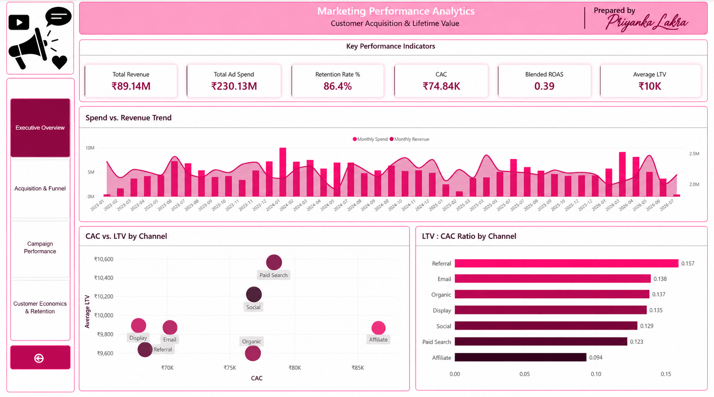
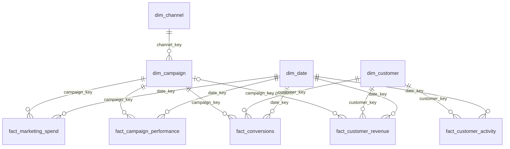
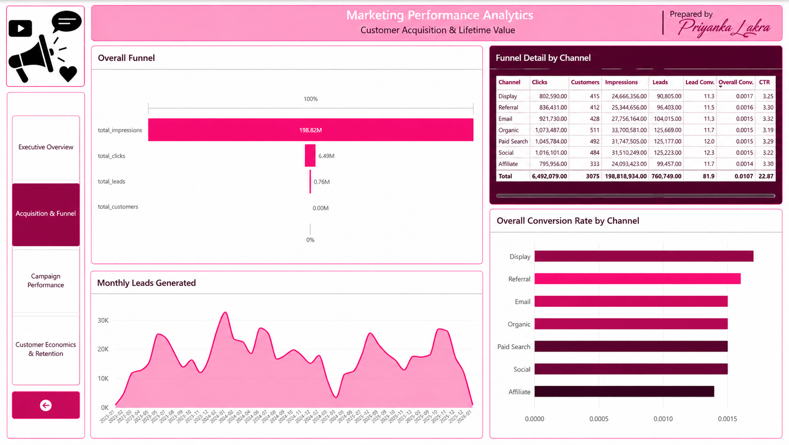
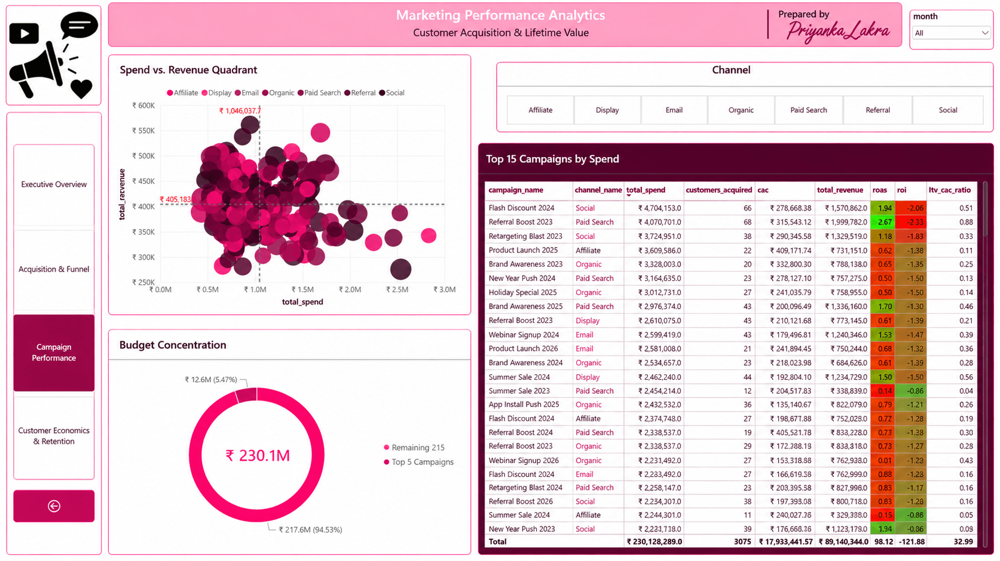
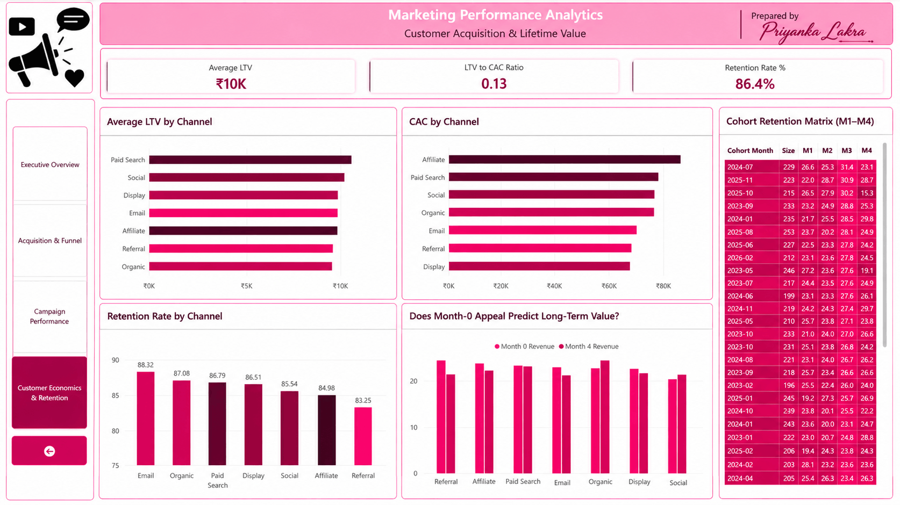

# 1. Marketing Performance, Customer Acquisition & Lifetime Value Analytics

**Does marketing spend buy customers who are worth what they cost?** An end-to-end analysis of 7 channels, 220 campaigns and 185K records — from raw CSV extracts to a MySQL star schema and a four-page Power BI dashboard.




| Marketing spend | Attributed revenue | Blended ROAS | ROI | CAC | Revenue per customer (observed LTV) | LTV : CAC |
|---:|---:|---:|---:|---:|---:|---:|
| ≈ ₹230M | ≈ ₹89M | 0.39 | −0.61 | ₹74.8K | ≈ ₹10K | 0.09 – 0.16 (every channel < 1) |

> **Executive Takeaways**
>
> - 🔴 **ROAS 0.39** — every ₹1 spent returned ₹0.39 of attributed revenue (0.36–0.42 in every channel).
> - 🔴 **LTV:CAC below 1 in all seven channels** — customers have generated ≈ ₹10K of revenue against a ₹74.8K acquisition cost.
> - 🔴 **99.6% lead-to-customer gap** — the largest funnel loss is downstream of the click, and is uniform across channels.
> - 🟠 **Affiliate underperforms** — highest CAC, lowest LTV, and the only channel statistically separable from the best.
> - 🟢 **Measure first, then reallocate** — attribution and LTV definitions must be fixed before budget is moved.
>
> *Statistical validation prevented a misleading recommendation: Referral has the highest LTV:CAC, but ANOVA (p = 0.27) and bootstrap confidence intervals show most channel differences sit within sampling variation. Only Affiliate is clearly weaker.*

> **Terminology.** "LTV" here means **observed (revenue) LTV** — a customer's cumulative net revenue to date. It is not margin-based and not a forecast of future value.

**Contents:** [1 Title](#1-marketing-performance-customer-acquisition--lifetime-value-analytics) · [2 Business problem](#2-business-problem--objective) · [3 Dataset](#3-dataset-description) · [4 Tools](#4-tools--technologies) · [5 Workflow](#5-project-workflow--methodology) · [6 KPIs & insights](#6-key-kpis--business-insights) · [7 Dashboard](#7-dashboard--visualizations) · [8 Repository](#8-repository-structure) · [9 How to run](#9-how-to-run-the-project) · [10 Recommendations & limitations](#10-recommendations-limitations--future-scope)

---

# 2. Business Problem & Objective

Marketing teams need to see both **acquisition efficiency** and **customer economics**. Seven channels and 220 campaigns were generating spend, but there was no consistent view of what a customer costs, what a customer is worth, and where prospects are lost. The project answers:

- Which channels and campaigns acquire the most customers, and at what cost (CAC)?
- Is customer lifetime value sufficient to justify acquisition cost (LTV:CAC)?
- Which channels and campaigns return more revenue per rupee spent (ROAS, ROI)?
- Where do prospects drop out of the funnel (impressions → clicks → leads → customers)?
- How well are customers retained, and do newer cohorts behave differently?
- Is spend concentrated in a few campaigns or spread thinly?

**Objectives**

1. Load, profile and validate six inconsistent source files.
2. Standardise dates, categories, currencies and keys; remove duplicates and invalid records.
3. Model the data as a star schema that supports spend, revenue, conversion and activity analysis without double counting.
4. Define and calculate CAC, LTV, LTV:CAC, ROAS, ROI, funnel conversion, retention and cohort KPIs.
5. Compare channels and campaigns and identify performance gaps.
6. Present the results in a Power BI dashboard and translate them into recommendations.

**Audience:** marketing and growth teams, campaign managers, business analysts and management.

**Summary of result.** Recorded revenue was well below spend (ROAS 0.39). CAC (₹74.8K) is roughly seven to eight times the revenue each customer has generated to date (≈ ₹10K). About 99.6% of leads do not appear as customers. Channel differences are small; only Affiliate stands out. On this data no channel recovers its acquisition cost, so the first priority is fixing measurement, not reallocating budget.

---

# 3. Dataset Description

| Dataset / table | Raw rows | Cleaned rows | Purpose |
|---|---:|---:|---|
| `customers.csv` | 10,500 | 9,985 | Customer profile, signup date, CRM acquisition channel |
| `campaigns.csv` | 225 | 220 | Campaign name, channel, type, start/end dates |
| `campaign_performance.csv` | 25,184 | 25,164 | Daily impressions, clicks, leads and spend per campaign |
| `conversions.csv` | 19,000 | 18,940 | Funnel-stage events (Lead, MQL, SQL, Opportunity, Customer) |
| `transactions.csv` | 58,310 | 58,000 | Customer purchases and refunds, with optional campaign ID |
| `activity.csv` | 72,000 | 72,000 | Customer engagement events (8 activity types) |
| **Total** | **185,219** | **184,309** | |

- **Period:** 2023-01-04 to 2026-07-15 for spend and performance (43 calendar months); transactions run to August 2026.
- **Key dimensions:** channel (7), campaign (220), campaign type (4), customer, date, industry, country.
- **Key measures:** spend, impressions, clicks, leads, revenue, conversion stage, activity events.
- **Granularity:** campaign × day (spend, performance); transaction; conversion event; activity event.
- **Source:** the files in `data_raw/`; the original source system is not documented in the repository.
- **Detail:** [docs/data_dictionary.md](docs/data_dictionary.md).

**Data privacy.** `data_raw/customers.csv` contains customer names and email addresses. All 9,987 populated email values (raw rows, including duplicates) use the reserved domains `example.com`, `example.net` and `example.org`, which are non-routable placeholders. No phone numbers, passwords, API keys or tokens were found in any file. Because the dataset's origin is not documented, mask or remove `customer_name` and `email` if any record derives from real individuals.

---

# 4. Tools & Technologies

| Area | Tools |
|---|---|
| Database / SQL | MySQL 8.0+ — CTEs, recursive CTEs, window functions, `REGEXP`, views, stored procedures, indexes (scripts also executed on MariaDB 10.11 for verification) |
| BI | Power BI Desktop — 4-page report, 12-table import model, 15 DAX measures |
| Programming | Python 3 (pandas, NumPy, SciPy) — independent validation only, not the main analysis |
| Version control | Git, GitHub |

Not used in this project: Tableau, Excel / Google Sheets, notebooks.

---

# 5. Project Workflow & Methodology

```
Raw CSVs ──► Load as text ──► Profile ──► Clean & type ──► Star schema ──► Validate
 (6 files)    (01)            (01b)       (02)             (03, 04)        (05)
                                                                              │
Recommendations ◄── Insights ◄── Dashboard ◄── Views / procs ◄── KPIs & analysis (06–13)
                                  (Power BI)      (14, 15)        funnel · CAC · ROAS · LTV
                                                                  retention · cohorts
```

## 5.1 Data cleaning and quality

`sql/01` loads everything as text so no load can fail; `01b` profiles every defect before any change; `02` writes typed `stg_*` tables. Full log: [docs/data_quality_log.md](docs/data_quality_log.md).

| Problem | Detection | Cleaning approach | Final result |
|---|---|---|---|
| Four date formats in every date column; 435 customer signup dates blank | Regex format census | `CASE` + `REGEXP` → `STR_TO_DATE`; missing dates mapped to a `19000101` unknown member | All dates typed; 4.0% of spend (₹9.2M) and 2,397 transactions are undated |
| 22 channel-name variants (53–72 raw spellings: "Paid-Search", "PPC", "Google Ads", "Affliate", …) | Distinct-value listing | `CASE` on `LOWER(TRIM())` | 7 canonical channels |
| ₹ and $ symbols and separators inside spend (3,116 rows) and revenue (3,665 rows) | Regex `[^0-9.-]` | `REGEXP_REPLACE` → `DECIMAL`; **no FX conversion** | Numeric fields |
| Duplicate customers (500 surplus rows + 15 blank ids), 5 duplicate campaigns, 300 duplicate transactions, 10 blank rows | Key-duplicate counts | `ROW_NUMBER()` de-duplication | 10,500 → 9,985 customers; 58,310 → 58,000 transactions |
| Negative spend (140 rows) and negative revenue (236 rows) | Sign check | Spend → NULL; revenue kept and flagged `is_refund` | Spend excludes ₹1.09M of negatives; revenue is net of ₹0.39M refunds |
| Clicks greater than impressions (259 rows) | Row comparison | Clicks set to NULL | 0 violations after cleaning |
| Orphan keys (20 performance rows, 60 conversions) | Anti-join | Removed by `INNER JOIN` to staged dimensions | 0 orphans in every fact |
| 9.9% of transactions (₹10.2M) have no campaign | Null-attribution check | Kept with NULL `campaign_key` | Excluded from ROAS; reported separately |
| About half of dated events fall before the recorded signup date | Caveat query in `11_retention_analysis.sql` | Retention logic counts only post-signup events | `signup_date` treated with caution |

Net effect: 910 of 185,219 rows (0.5%) removed; other defects were nulled or flagged rather than deleted.

## 5.2 Data model

A star schema with five fact tables and four dimensions ([diagram, grain and design notes](docs/data_model.md)); relationships are the foreign keys declared in `sql/03_database_schema.sql`.



**Why this design.** Spend and traffic are campaign-day, revenue is per transaction, conversions and activity are events — different grains, so each is its own fact table, and KPI queries aggregate each one separately before combining (preventing double counting). The unknown-date member keeps undated records in the totals; surrogate keys keep joins compact.

**Reporting layer.** Three materialised tables (first-touch attribution, customer LTV, customer retention) and eleven views, refreshed by `sp_refresh_materialized_tables`, give every report one definition of each metric. Power BI imports these views ([model, relationships and DAX measures](docs/powerbi_model.md)).

## 5.3 SQL analysis

Scripts `06`–`13` contain roughly 70 analytical queries ([index](sql/README.md)).

| Technique | Where | Why it was needed |
|---|---|---|
| CTEs that aggregate each fact separately | all KPI scripts | Joining spend, conversions and revenue directly would multiply rows and overstate totals |
| `ROW_NUMBER() OVER (PARTITION BY customer ORDER BY date)` | first-touch attribution, de-duplication | Count each customer once and assign them to the campaign that converted them first |
| `RANK` / `DENSE_RANK` / `NTILE` / `PERCENT_RANK` | `07`, `09`, `10`, `13` | Rank channels and campaigns and flag quartiles that totals alone hide |
| `LAG` and moving-average frames | `06`, `08`, `09` | Month-over-month growth and 3-month smoothing of CAC and ROAS |
| `AVG(x) OVER ()` quadrant flags | `07`, `09`, `13` | Compare each campaign with the portfolio average without a self-join |
| Recursive CTE calendar | `04` | Build a date dimension without an external table |
| `TIMESTAMPDIFF(MONTH, …)` cohort offsets | `12` | Align customers by months since signup |
| Views, materialised tables, stored procedures | `14`, `15` | Reusable, consistent KPI definitions for Power BI |

**Customer acquisition cost by channel** — *What does it cost to acquire a customer in each channel?*

```sql
-- sql/08_cac_analysis.sql (Q2), abridged
WITH first_customer_conversion AS (
    SELECT fc.customer_key, fc.campaign_key,
           ROW_NUMBER() OVER (PARTITION BY fc.customer_key ORDER BY dd.full_date) AS rn
    FROM fact_conversions fc JOIN dim_date dd ON fc.date_key = dd.date_key
    WHERE fc.conversion_stage = 'Customer' AND dd.date_key <> 19000101
),
channel_customers AS (  -- customers per channel, each counted once
    SELECT dch.channel_name, COUNT(*) AS customers_acquired
    FROM first_customer_conversion fcc
    JOIN dim_campaign dcamp ON fcc.campaign_key = dcamp.campaign_key
    JOIN dim_channel  dch   ON dcamp.channel_key = dch.channel_key
    WHERE fcc.rn = 1 GROUP BY dch.channel_name
),
channel_spend AS (
    SELECT dch.channel_name, SUM(fms.spend) AS total_spend
    FROM fact_marketing_spend fms JOIN dim_channel dch ON fms.channel_key = dch.channel_key
    GROUP BY dch.channel_name
)
SELECT cs.channel_name, cs.total_spend, cc.customers_acquired,
       ROUND(cs.total_spend / NULLIF(cc.customers_acquired, 0), 2) AS cac
FROM channel_spend cs LEFT JOIN channel_customers cc USING (channel_name);
```
*Shows:* CAC from ₹67.8K (Display) to ₹86.7K (Affiliate, which spends ₹28.9M for only 333 customers).

**Return on ad spend** — *How much revenue does each ₹1 return, and is any channel profitable on a revenue basis?*

```sql
-- sql/09_campaign_analysis.sql (Q5/Q9), abridged
SELECT cs.channel_name,
       ROUND(cr.total_revenue / NULLIF(cs.total_spend, 0), 3)                     AS roas,
       ROUND((cr.total_revenue - cs.total_spend) / NULLIF(cs.total_spend, 0), 3) AS roi
FROM channel_spend cs JOIN channel_revenue cr ON cs.channel_name = cr.channel_name;
```
*Shows:* ROAS 0.36 (Affiliate) – 0.42 (Referral); ROI −0.58 to −0.64 by channel and **−0.61 for the portfolio** (`vw_kpi_summary`), computed as a ratio of sums. Adding the 220 campaign ROIs would give a meaningless −121.86.

**Observed LTV versus CAC** — *Have customers generated enough revenue so far to cover what they cost to acquire?*

```sql
-- sql/10_ltv_analysis.sql (Q5), abridged
SELECT channel_name, ROUND(cac, 2) AS cac, ROUND(avg_ltv, 2) AS avg_ltv,
       ROUND(avg_ltv / NULLIF(cac, 0), 3) AS ltv_to_cac_ratio,
       CASE WHEN avg_ltv / NULLIF(cac, 0) >= 3 THEN 'STRONG'
            WHEN avg_ltv / NULLIF(cac, 0) >= 1 THEN 'MARGINAL'
            ELSE 'POOR' END AS unit_economics_verdict
FROM channel_metrics;
```
*Shows:* all seven channels are "POOR" (0.094–0.157); even the best recovers about 16 paise of acquisition cost per rupee.

**Retention flag and cohort matrix** — *Do customers stay active, and how does activity evolve by signup cohort?*

```sql
-- sql/11_retention_analysis.sql, abridged: 1 if any activity/purchase occurs > 30 days after signup
MAX(CASE WHEN pse.event_date > dc.signup_date + INTERVAL 30 DAY THEN 1 ELSE 0 END) AS is_retained

-- sql/12_cohort_analysis.sql, abridged: active customers per month offset
COUNT(DISTINCT CASE WHEN TIMESTAMPDIFF(MONTH, cc.signup_date, ee.event_date) = 1
                    THEN cc.customer_key END) / COUNT(DISTINCT cc.customer_key) AS m1_retention
```
*Shows:* 86.4% of customers have a later event after day 30, but in any given month only about a quarter of a cohort is active (average 23.9–25.2% for M1–M4). The two measures answer different questions.

## 5.4 Python validation

The analysis is in SQL; Python is used for **independent validation**. `validation/verify_kpis.py` (pandas, NumPy, SciPy) recomputes cleaning and KPIs straight from `data_raw/`; output is in [`validation/validation_output.txt`](validation/validation_output.txt). No notebook, plotting or modelling code exists in the repository.

| Question | Method | Result | Interpretation |
|---|---|---|---|
| Do the SQL KPIs reproduce independently? | Re-implemented every cleaning rule and the first-touch, LTV and retention logic | Row counts, 3,075 acquired customers, CAC ₹74,843, LTV:CAC by channel and retention 86.45% match the SQL output exactly | The pipeline is reproducible; the dashboard traces back to the SQL |
| Do the two channel fields agree? | Compared first-touch campaign channel with `customers.acquisition_channel` for the 3,075 acquired customers | 14.8% agree (random assignment ≈ 14.3%) | "Channel" means different things in different fields; do not mix them without reconciling |
| Are channel differences distinguishable from noise? | ANOVA on revenue per customer, chi-square on customers vs impressions, bootstrap CIs for LTV:CAC | ANOVA p = 0.27; chi-square p = 0.21; intervals overlap for six of seven channels — only Affiliate (0.081–0.109) and Referral (0.135–0.182) separate | Apart from Affiliate, channel rankings are within sampling variation |

```python
rng = np.random.default_rng(42)
for ch, g in ft.groupby("channel"):
    cac = spend_by_ch[ch] / len(g)
    boot = [rng.choice(g.ltv.values, len(g)).mean() for _ in range(2000)]
    print(ch, g.ltv.mean() / cac, np.percentile(boot, [2.5, 97.5]) / cac)
```

> **Why this matters.** A ranking-only analysis would have recommended scaling Referral (LTV:CAC 0.157). Its interval overlaps those of five other channels, so that recommendation is not supported by the data; the same test identifies Affiliate as the one channel worth acting on.

---

# 6. Key KPIs & Business Insights

## 6.1 KPI framework

| KPI | Definition | Value | Why it matters |
|---|---|---:|---|
| Marketing spend | Sum of daily campaign spend (negative entries excluded) | ₹230.14M | Total investment under evaluation |
| Attributed revenue | Net revenue of transactions that carry a campaign | ₹89.17M | Return that can be tied to a campaign (₹99.39M incl. unattributed) |
| ROAS | Attributed revenue ÷ spend | 0.39 | Sales returned per ₹1 of spend |
| ROI | (Attributed revenue − spend) ÷ spend = ROAS − 1, computed from totals — never by adding per-campaign ROI | −0.61 | Net return on a revenue basis (no margin data exists, so not profit) |
| CAC | Spend ÷ customers acquired (first-touch) | ₹74.8K | Cost to win one customer |
| Observed LTV | Cumulative net revenue per customer to date | ≈ ₹10K | Value generated so far; not margin-based, not a forecast |
| LTV : CAC | Average observed LTV ÷ CAC | 0.09 – 0.16 | Whether acquisition cost is recovered (3:1 is a common benchmark) |
| CTR / lead rate / lead-to-customer | Clicks ÷ impressions; leads ÷ clicks; customers ÷ leads | 3.27% / 11.72% / 0.40% | Where the funnel loses volume |
| Retention rate | Customers with any activity or purchase > 30 days after signup ÷ customers | 86.4% | Whether customers return after the first month |
| Cohort retention (M1–M4) | Share of a signup-month cohort active in month *k* after signup | 23.9–25.2% | Shape of engagement over time |
| Top-5 spend share | Spend of five largest campaigns ÷ total spend | 5.47% | Budget concentration |

Formulas, SQL sources and caveats: [docs/kpi_definitions.md](docs/kpi_definitions.md).

## 6.2 Key findings

**1. Recorded revenue is well below marketing spend.**
*Evidence:* ₹230.1M spend vs ₹89.2M attributed revenue (₹99.4M including unattributed); ROAS 0.39 (0.43 on total revenue); channel ROAS 0.36–0.42; no campaign reaches ROAS 1 (highest 0.96); monthly ROAS exceeded 1 in only 4 of 43 months, all with low spend (₹0.4M–₹1.7M).
*Meaning:* spend has not been returned in revenue anywhere in the portfolio. Revenue is not profit and only revenue to date is observed, so this is a gap to explain, not proof that marketing destroys value.

**2. Acquisition cost is roughly seven to eight times the value generated per customer so far.**
*Evidence:* CAC ₹74.8K vs ≈ ₹10K; customers average 5.8 transactions of ≈ ₹1,714, so covering CAC would take about 44 transactions.
*Meaning:* because LTV is observed rather than forecast, a longer horizon would raise it, but retention alone cannot be assumed to close a gap of this size — acquisition cost, value per customer and data completeness need review first.

**3. Affiliate is the only clearly weaker channel.**
*Evidence:* highest CAC (₹86.7K), lowest observed LTV (₹8.2K), LTV:CAC 0.094, taking 12.5% of spend for 10.8% of acquired customers; its bootstrap interval does not overlap Referral's. The other five channels (0.123–0.157) overlap one another.
*Meaning:* Affiliate is the strongest candidate for review; the ordering of the others, including Referral as "best", is not statistically reliable.

**4. The funnel loses nearly everything between lead and customer.**
*Evidence:* 198.8M impressions → 6.49M clicks → 0.76M leads → 3,075 customers; CTR 3.27% (3.19–3.32% across channels), click-to-lead 11.72%, lead-to-customer 0.40%.
*Meaning:* top-of-funnel efficiency is uniform; the loss sits downstream (sales process, lead quality or tracking). Leads and customers come from separate sources with no shared ID, so the stage of loss cannot be located from this data.

**5. Spend is spread thinly across campaigns.**
*Evidence:* the top five campaigns hold 5.47% of spend (2.3% would be uniform); campaign spend ranges ₹0.43M–₹2.83M; ROAS by campaign type is similar (0.37–0.44).
*Meaning:* no small set of dominant campaigns to cut; reallocation has to work across many mid-sized campaigns.

**6. Customer value is concentrated in a minority of customers.**
*Evidence:* median revenue per customer ₹4,075 vs mean ₹9,954; the top 10% of customers generate 48.6% of revenue.
*Meaning:* averages overstate the typical customer; value segmentation would show where acquisition works.

**7. Retention depends on the definition used.**
*Evidence:* 86.4% return after day 30 at some point, but only about a quarter of each signup cohort is active in any month (no visible trend across cohorts); the flag has no time limit, about half of dated events precede signup, and 414 customers have no signup date.
*Meaning:* the headline retention figure is not monthly stickiness; use a windowed, eligibility-adjusted measure. These are associations — nothing here shows what *causes* retention.

## 6.3 Business impact

| Area | Observed impact | Business implication |
|---|---|---|
| Acquisition economics | LTV:CAC below 1 in all seven channels; ROAS 0.39; ROI −0.61 | The acquisition model does not currently recover its cost on recorded revenue |
| Affiliate | Highest CAC, lowest LTV, LTV:CAC 0.094 | Priority channel for review and testing |
| Funnel | 99.6% of leads do not appear as customers, in every channel | A downstream conversion or measurement issue, not a channel-selection issue |
| Attribution | 9.9% of revenue (₹10.2M) has no campaign; channel fields agree for 14.8% of customers | Campaign and channel ROAS cannot be fully trusted yet |
| Customer value | Top 10% of customers generate 48.6% of revenue | Value-based segmentation matters more than the average customer |
| Budget structure | Top 5 of 220 campaigns hold 5.47% of spend | No small set of campaigns to cut |

**Observed vs potential impact.** No marketing decision was changed or tested in this project, so no financial outcome is claimed.
*Observed:* no acquisition channel recovers its cost on recorded revenue, and the data cannot yet separate most channels from one another.
*Potential:* unifying attribution, reviewing Affiliate spend and locating the lead-to-customer bottleneck could improve acquisition efficiency; the size of any gain cannot be estimated from this data and requires controlled testing.

---

# 7. Dashboard & Visualizations

### Page 1 — Executive Overview
**Purpose:** leadership view of spend, return and unit economics. **KPIs:** revenue, spend, retention, CAC, blended ROAS, overall ROI, average LTV. **Visuals:** monthly spend vs revenue, CAC vs LTV by channel, LTV:CAC by channel. **Answers:** is spend paying back, and which channels are cheapest or most valuable?


### Page 2 — Acquisition & Funnel
**Purpose:** locate funnel loss by channel. **Visuals:** overall funnel, channel funnel table, monthly leads, conversion rate by channel. **Answers:** which stage loses the most volume, and do channels differ?



### Page 3 — Campaign Performance
**Purpose:** find campaigns where spend is not matched by revenue. **Visuals:** spend-vs-revenue quadrant, budget-concentration donut, campaign table with ROAS/ROI, month and channel filters. **Answers:** which campaigns are high-spend/low-revenue, and is the budget concentrated?



### Page 4 — Customer Economics & Retention
**Purpose:** compare customer value with cost and track retention. **Visuals:** LTV, CAC and retention by channel, month-1 vs month-4 retention %, cohort retention matrix. **Answers:** do cheaper channels bring lower-value customers, and do cohorts retain differently?



---

# 8. Repository Structure

```text
marketing-analytics-mysql-powerbi/
├── README.md                     Case study
├── LICENSE                       MIT
├── requirements.txt              Python dependencies for validation/
├── data_raw/                     Six source CSV extracts (185,219 rows)
│   ├── customers.csv
│   ├── campaigns.csv
│   ├── campaign_performance.csv
│   ├── conversions.csv
│   ├── transactions.csv
│   └── activity.csv
├── sql/                          MySQL pipeline, run in numeric order (index: sql/README.md)
│   ├── 01_raw_staging_setup.sql
│   ├── 01b_raw_data_validation.sql
│   ├── 02_data_cleaning.sql
│   ├── 03_database_schema.sql
│   ├── 04_populate_star_schema.sql
│   ├── 05_data_quality.sql
│   ├── 06_acquisition_analysis.sql … 13_advanced_analysis.sql
│   ├── 14_create_views.sql
│   └── 15_stored_procedures.sql
├── powerbi/                      marketing_analytics.pbix and 4 page screenshots
├── results/                      CSV exports of key reporting views from a full run
├── validation/                   verify_kpis.py + saved output (independent check)
└── docs/                         Data dictionary, data model, Power BI model, data-quality log,
                                  KPI definitions, dashboard guide, Power BI fix guide, validation notes
```

---

# 9. How to Run the Project

**Requirements:** MySQL 8.0+ (client and server); Power BI Desktop for the dashboard; Python 3.9+ only for the validation script.

1. **Clone**
   ```bash
   git clone https://github.com/priyankadatacodes/marketing-analytics-mysql-powerbi.git
   cd marketing-analytics-mysql-powerbi
   ```
2. **Point the loader at the data.** In `sql/01_raw_staging_setup.sql`, replace `C:/ProgramData/MySQL/MySQL Server 8.0/Uploads` with the absolute path of this repository's `data_raw/` folder. The MySQL server must be permitted to read it (`SHOW VARIABLES LIKE 'secure_file_priv';`).
3. **Run the SQL pipeline in order** (creates the `marketing_analytics` database):
   ```bash
   for f in 01_raw_staging_setup 01b_raw_data_validation 02_data_cleaning 03_database_schema \
            04_populate_star_schema 05_data_quality 06_acquisition_analysis 07_funnel_analysis \
            08_cac_analysis 09_campaign_analysis 10_ltv_analysis 11_retention_analysis \
            12_cohort_analysis 13_advanced_analysis 14_create_views 15_stored_procedures; do
     mysql -u <user> -p --table < "sql/$f.sql" > "out_$f.txt"
   done
   ```
   On a fresh database this reproduces the row counts in [section 3](#3-dataset-description). Re-running `03` on an existing schema requires dropping the `fact_*` tables first.
4. **Check the results** against [`results/`](results/) and [`validation/validation_output.txt`](validation/validation_output.txt).
5. **Independent validation (optional):**
   ```bash
   pip install -r requirements.txt
   python validation/verify_kpis.py
   ```
6. **Dashboard.** Open `powerbi/marketing_analytics.pbix` in Power BI Desktop (it holds an imported snapshot of the views). To refresh from your own database, point the data source at the `marketing_analytics` MySQL database.

---

# 10. Recommendations, Limitations & Future Scope

## 10.1 Recommendations

**1. Fix measurement before moving budget.**
*Problem:* channel is defined three ways (CRM field, first-touch campaign, campaign on each transaction), and the first two agree for 14.8% of customers; LTV is observed revenue only; retention is an unbounded flag.
*Recommendation:* agree one customer-to-channel attribution rule, report margin-based forecast LTV alongside observed LTV with a stated horizon, and define retention at fixed 30/60/90-day windows for eligible customers.
*Direction:* channel comparisons that finance and marketing can both rely on.

**2. Review and test the Affiliate programme.**
*Problem:* highest CAC and lowest LTV:CAC; its interval is separate from Referral's.
*Recommendation:* review partners and terms, and test a reduction or restructure against a holdout rather than shifting budget on rank alone.
*Direction:* a measured view of Affiliate's incremental contribution before changing its budget share.

**3. Investigate the lead-to-customer gap.**
*Problem:* 99.6% of leads do not appear as customers, uniformly across channels; the five conversion stages were not used for a stage-level funnel.
*Recommendation:* link lead identifiers to CRM records and analyse Lead → MQL → SQL → Opportunity → Customer progression to find the stage of loss and whether it is a sales-process or tracking issue.
*Direction:* a located, addressable bottleneck instead of an aggregate rate.

**4. Validate revenue attribution before campaign-level optimisation.**
*Problem:* 9.9% of revenue has no campaign; about 89% of attributed transactions fall outside their campaign's dates; spend and campaign revenue are not positively related.
*Recommendation:* capture an order-level campaign key (click or coupon ID) with attribution windows; treat current campaign ROAS as descriptive until then.
*Direction:* campaign decisions grounded in credible attribution.

**5. Segment customers by value and monitor reconciled KPIs.**
*Problem:* half of revenue comes from about 10% of customers, and several dashboard totals and definitions were inconsistent.
*Recommendation:* add value-decile analysis to the customer page, rebuild table totals as ratio measures, and monitor spend, attributed vs total revenue, CAC, ROAS and ROI each period.
*Direction:* dashboards whose totals tie to the SQL source and whose averages are not skewed by a few large customers.

**Priority matrix**

| Priority | Issue | Evidence | Recommended action |
|---|---|---|---|
| 🔴 High | Measurement and attribution | 14.8% channel-field agreement; 9.9% of revenue unattributed | One attribution rule and an order-level campaign key |
| 🔴 High | Lead-to-customer conversion | 99.6% of leads not converting | Stage-level funnel |
| 🟠 Medium | Affiliate economics | Highest CAC, lowest LTV, interval separate from Referral | Holdout test of a reduction or restructure |
| 🟠 Medium | Customer value concentration | Top 10% = 48.6% of revenue | Value-based segmentation |
| 🟡 Lower | Campaign-level optimisation | Top 5 campaigns = 5.47% of spend; no campaign has ROAS ≥ 1 | Avoid simplistic campaign cuts until attribution is fixed |

## 10.2 Limitations and assumptions

- **Three channel bases.** CAC, customer counts, retention-by-channel and LTV:CAC use the first-touch campaign channel; "Average LTV by channel" uses the CRM `acquisition_channel`; ROAS uses the channel of the campaign on each transaction.
- **LTV is observed revenue to date** — no margin, no forecast; recent customers have had less time to spend. ROI and ROAS are revenue-based, not profit-based.
- **Retention** is an unbounded flag; about half of dated events precede the recorded signup date; 414 customers have no signup date.
- **Attribution** is unreliable at campaign level (9.9% of revenue unattributed; ~89% of attributed transactions fall outside campaign dates; spend and revenue are negatively correlated across campaigns, r = −0.20).
- **Funnel populations differ:** impressions, clicks and leads come from performance reports, customers from conversion records with no lead identifier.
- **Currency:** `$`-marked values were treated as ₹ with no conversion; 140 negative spend entries (−₹1.09M) were excluded rather than treated as credits.
- **Statistical power:** apart from Affiliate vs Referral, channel differences are within sampling variation.
- **Data provenance:** the origin of the dataset and a source-system dictionary are not available in the repository.
- **Dashboard:** the corrected `.pbix` has not yet been opened in Power BI Desktop to re-export the screenshots; the model is a hub of channel-level views, so true ratio-of-sums totals in tables need new DAX measures 
- **Validation:** all 16 scripts were re-executed (MariaDB 10.11 stand-in) and independently recomputed; discrepancies found in earlier figures are listed in [docs/validation_notes.md](docs/validation_notes.md).

## 10.3 Future scope

| Horizon | Action | Success measure |
|---|---|---|
| **Next 30 days** | Standardise attribution to one rule; link lead IDs to CRM customers; add ratio measures to Power BI and re-export screenshots | Channel fields reconcile; every dashboard total ties to the SQL source |
| **Next 60 days** | Test an Affiliate reduction against a holdout; build 30/60/90-day retention for eligible customers; add margin-based, forecast LTV | Incremental CAC/ROAS with confidence intervals; comparable cohort retention |
| **Next 90 days** | Run controlled budget experiments; evaluate incremental CAC and ROAS; reallocate only where results are statistically supported | A pre-agreed decision rule is met before any reallocation |

Further ideas: multi-touch attribution (528 customers converted via two or more campaigns), customer segmentation and predictive LTV, budget optimisation, automated reporting, and incrementality testing.

---

**Author:** Priyanka Lakra — Data Analyst · SQL · Power BI · Business Analytics · [Portfolio](https://bloomindata.in/) · [GitHub](https://github.com/priyankadatacodes)
Licensed under the [MIT License](LICENSE).
