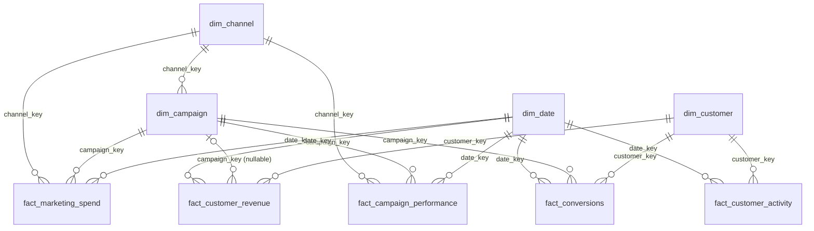

# Data Model

The cleaned data is organised as a star schema in MySQL (`sql/03_database_schema.sql`, `sql/04_populate_star_schema.sql`).
Every relationship below is a foreign key declared in the DDL.

## Grain

| Fact | One row represents |
|---|---|
| `fact_marketing_spend` | one campaign on one day (spend) |
| `fact_campaign_performance` | one campaign on one day (impressions, clicks, leads) |
| `fact_customer_revenue` | one transaction |
| `fact_customer_activity` | one customer activity event |
| `fact_conversions` | one customer × campaign × funnel-stage event |

## Design decisions and their purpose

- **Raw → staging → model layers.** Raw tables are all text so the load cannot fail; typing and cleaning happen in staging where each rule is explicit and countable.
- **Surrogate integer keys** on dimensions keep fact joins small and insulate the model from formatting differences in source IDs; natural IDs are kept as unique columns.
- **Unknown-date member (`19000101`).** Rows with a missing or unparseable date stay in the facts (so headline totals reconcile to the source) and are excluded only from time-series logic.
- **Separate facts for different grains.** Spend/traffic (campaign-day), revenue (transaction), activity and conversions (events) are never joined to each other directly; each KPI query aggregates every fact in its own CTE and joins the results on conformed keys. This prevents the row multiplication that would otherwise double-count spend or revenue.
- **Nullable `campaign_key` on revenue.** About 9.9% of transactions carry no campaign; they remain valid revenue but cannot be attributed to a channel.
- **Materialised first-touch attribution** (`tbl_customer_first_touch`) so every CAC/LTV query shares one customer-to-channel rule.

## Known modelling limitations

- `dim_customer.acquisition_channel` is a text attribute from the CRM extract, not a foreign key to `dim_channel`. Channel is therefore defined in two different ways (CRM field vs. first-touch campaign channel), and the two agree for only 14.8% of acquired customers (see [validation_notes.md](validation_notes.md)).
- `campaign_name` is not unique (220 campaigns, roughly 48–51 distinct names); always use `campaign_id` / `campaign_key`.
- `fact_marketing_spend` and `fact_campaign_performance` are loaded from the same source rows at the same grain; they could be a single fact table.
- Customer attributes are overwritten, not versioned (no slowly-changing-dimension history).
- Power BI relationships and cardinality are documented in [powerbi_model.md](powerbi_model.md): the report model is a hub of channel-level views, not this star schema.
